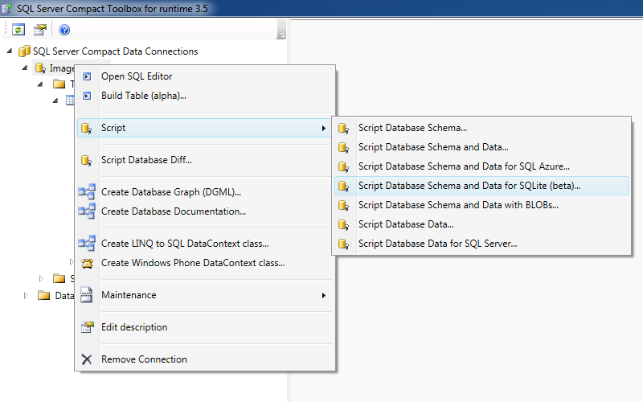

# Neatr
This provides guidance and tools to migrate and extract data from the Windows version of the obsolete Neat Digital Filing System. The extracted documents will be saved on the filesystem as searchable PDF files. The documents exist in the Neat database as JPEG blobs. The tools in this repository will help migrating and extracting the document and receipt data.

## Overview
The NeatDesk Desktop Scanner and bundled software was designed for both Windows and macOS. The main audience was the home user. The software provided an easy way to perform paper digitisation will full text search capabilities. When using Windows the underlying data was stored in an [SQL Server Compact](https://en.wikipedia.org/wiki/SQL_Server_Compact) 3.5 database. The process outlined here will guide you through:

- Migrating the documents to an [SQLite](https://en.wikipedia.org/wiki/SQLite) database.
- Extracting the image data from the SQLite database in preparation for digitisation.
- Digitising using [Tesseract](https://en.wikipedia.org/wiki/Tesseract_(software)) to create searchable PDF files.
- Enriching using document and receipt information stored in the Neat database.

## Migration
The Neat application software has multiple backing databases.  Follow these steps to migrate the databases to a single SQLite database:

1. Locate your Neat database. The path will typically be `%USERPROFILE%\Documents\Neat Data`.
2. Copy the files with the extension `.nwdb` to another location.  These are the SQL Server Compact databases.
3. Rename the files to have the extension `.sdf`.
4. Download and run [SQLite & SQL Server Compact Toolbox](https://github.com/ErikEJ/SqlCeToolbox) for version 3.5.
5. Open the first image database which should now be named `ImageDB1.sdf`.
6. Right click on the database and select "Script" > "Script Database Schema and Data for SQLite (beta)..." (see figure 1).

<p align="center">
  
  <p align="center">
    Figure 1: script the first image database
  </p>
</p>

8. Name the file `dump.sql` and save in a new directory called `Images_001`. The process should create multiple files.
9. Repeat this step for all image databases. Name the output folders sequentially (e.g. `Images_002`).
10. Open the document database which should now be named `Neatworks.sdf`.
11. Right click on the database and select "Script" > "Script Database Schema and Data for SQLite (beta)...".
12. Name the file `dump.sql` and save in a new directory called `Neatworks`.
13. Move the script files to a Linux machine.
14. Run `scripts\migrate.sh` in a directory containing all of the output folders.

Upon completion you will be left with `neat.db` which is an SQLite database containing the migrated Neat data. Move this file to `/tmp/neatr/neat.db`.

## Extraction

The first step in the process is to extract the image blobs from the database. The documents can be extracted by running the neatr module (see [here](https://stackoverflow.com/questions/16981921/relative-imports-in-python-3)):

```bash
python -m neatr -n /tmp/neatr/neat.db -p /tmp/documents -d
```

This will extract the image blobs and store them under `/tmp/documents` using the internal Neat image [UUID](https://en.wikipedia.org/wiki/Universally_unique_identifier) as the file name. The page relationships are also stored in text files using the document UUID.

The receipts can be extracted as follows:

```bash
python -m neatr -n /tmp/neatr/neat.db -p /tmp/receipts -r
```

## Digitisation

The two folders `/tmp/documents` and `/tmp/receipts` will contain images and page relationships. These are in a format which can be digitised by Tesseract.  In both folders run:

```bash
./ocr.sh
```

This will generate text searchable PDF files from the images listed in the page relationship files.

## Development

It is recommended to use VSCode as the main development environment.

The configuration I've found which works best is via using the core [Python extension](https://marketplace.visualstudio.com/items?itemName=ms-python.python) and [Pylance](https://devblogs.microsoft.com/python/announcing-pylance-fast-feature-rich-language-support-for-python-in-visual-studio-code/) as a language server.

Starting with Python 3.3 there is support for [virtual environments](https://packaging.python.org/tutorials/installing-packages/#creating-and-using-virtual-environments). In the project root execute the following to create a virtual environment:

```bash
python3 -m venv .venv
```

Depending upon your shell you should then activate the environment within any active shell:

```bash
source .venv/bin/activate.fish
```

Check that pip is working within the virtual environment:

```bash
python -m pip --version
```

Once this has been created you should ensure that VSCode is using this as it's environment. From within VS Code, select a Python 3 interpreter by opening the Command Palette (Ctrl+Shift+P), start typing the `Python: Select Interpreter` command to search, then select the command.

## References
http://myembeddedlinux.blogspot.com/2016/03/convert-sql-server-compact-database-sdf.html
http://erikej.blogspot.com/2009/04/sql-compact-3rd-party-tools.html
